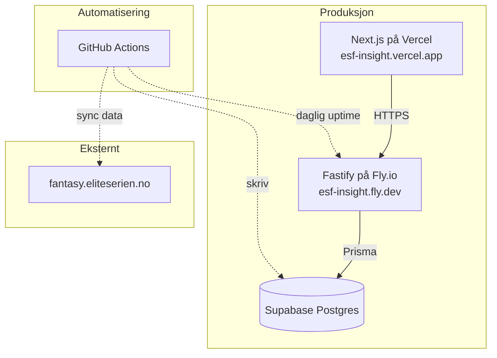

# Eliteserien Fantasy

Statistikk-, sammenligning- og beslutningsstøtte-applikasjon for Eliteserien Fantasy. Henter data fra `fantasy.eliteserien.no`, lagrer i Postgres og presenterer det i en Next.js-frontend.

## 🚀 Live demo

**https://esf-insight.vercel.app/**

Vil du se appen i bruk uten å ha eget lag i Eliteserien Fantasy? Søk etter `Sindre Ulsaker` så ser du hvordan jeg gjør det denne sesongen.

## Arkitektur

Monorepo med pnpm workspaces:

- **Frontend** (`apps/web`): Next.js 14 (App Router), React 18, TypeScript. Deployet på Vercel.
- **Backend** (`apps/api`): Fastify REST API på Node 20. Deployet på Fly.io med scale-to-zero.
- **DB**: PostgreSQL via Supabase i prod, lokal Docker Postgres i dev. Prisma ORM.
- **Datapipeline**: GitHub Actions cron-jobber håndterer sync mot Fantasy-API'et rundt deadlines og runde-slutt.
- **Uptime-monitoring**: Daglig health-sjekk via GitHub Actions.


```mermaid
graph TB
    subgraph "Produksjon"
        Web[Next.js på Vercel<br/>esf-insight.vercel.app]
        API[Fastify på Fly.io<br/>esf-insight.fly.dev]
        DB[(Supabase Postgres)]
    end

    subgraph "Eksternt"
        Fantasy[fantasy.eliteserien.no]
    end

    subgraph "Automatisering"
        GHA[GitHub Actions]
    end

    Web -->|HTTPS| API
    API -->|Prisma| DB
    GHA -.->|sync data| Fantasy
    GHA -.->|skriv| DB
    GHA -.->|daglig uptime| API
```

## Teknologier

- **Frontend**: Next.js 14, React 18, TypeScript
- **Backend**: Fastify 4, Node 20, TypeScript, Prisma 5
- **Database**: PostgreSQL 16
- **Tester**: Vitest (unit), Playwright (E2E)
- **Lint/format**: ESLint, Prettier, Husky + lint-staged
- **CI/CD**: GitHub Actions (lint, typecheck, test, build, deploy, uptime)
- **Hosting**: Vercel (web), Fly.io (api), Supabase (db)

## Lokal utvikling

Krav:

- Node 20+
- pnpm 8+
- Docker Desktop (for lokal PostgreSQL)

```bash
# Installer dependencies
pnpm install

# Kopier env-mal og fyll inn verdier
cp .env.example .env

# Start lokal Postgres
docker compose up -d

# Generer Prisma-klient og kjør migrasjoner
pnpm db:generate
pnpm db:migrate

# Start dev-servere (web + api parallelt)
pnpm dev
```

- Frontend: http://localhost:3000
- API: http://localhost:3001
- API health: http://localhost:3001/health

## Skripter

### Utvikling og kvalitet

```bash
pnpm dev                       # Web + api parallelt
pnpm --filter web dev          # Bare web
pnpm --filter api dev          # Bare api
pnpm typecheck                 # TypeScript-sjekk
pnpm lint                      # ESLint
pnpm test                      # Vitest unit-tester
pnpm test:e2e                  # Playwright E2E
pnpm format                    # Prettier
```

### Database

```bash
pnpm db:generate               # Generer Prisma-klient
pnpm db:migrate                # Kjør migrasjoner
pnpm db:studio                 # Prisma Studio (DB-GUI)
```

### Data-sync (kjøres normalt automatisk via GH Actions)

```bash
pnpm --filter api data:sync-players
pnpm --filter api data:sync-teams
pnpm --filter api data:sync-gameweeks
pnpm --filter api data:sync-player-gw-stats
pnpm --filter api compute:template-eo
pnpm --filter api compute:bracket-stats-snapshot
pnpm --filter api compute:entry-season-totals
pnpm --filter api jobs:plan
pnpm --filter api jobs:execute
```

## Deploy

API auto-deployer til Fly.io ved push til `main` (se `.github/workflows/fly-deploy.yml`). Frontend auto-deployer til Vercel.

Manuelt:

```bash
fly deploy        # Bygg + rull ut API
fly logs          # Live API-logger
fly status        # Maskinstatus
```

Frontend-deploys og preview-URLs styres fra Vercel-dashboardet.

## Miljøvariabler

Se `.env.example` for full liste. De viktigste:

- `DATABASE_URL` / `DIRECT_URL` — Postgres (pooled + direct for Prisma migrate)
- `ESF_BASE_URL` — `https://fantasy.eliteserien.no`
- `OVERALL_LEAGUE_ID` — `329` (Eliteseriens overall-liga)
- `CORS_ORIGINS` — Komma-separert allowlist
- `NEXT_PUBLIC_API_BASE` — Frontend → API URL (Vercel build-time)

## Domenemodell

Forenklet:

- `Entry` — Fantasy-lag (manager)
- `EntryGameweek` / `EntryPick` — Picks per runde
- `Player` / `Team` / `Gameweek` — Grunnleggende ressurser
- `PlayerGameweekStats` — Poeng og statistikk per spiller per runde
- `EffectiveOwnership` — Hvor stor andel av topp-N som eier hver spiller
- `BracketStats` — Aggregert statistikk per rank-bracket
- `EntryInsights` / `EntrySeasonTotals` — Beregnet analyse per entry
- `JobSchedule` — Kø for cron-trigget data-pipeline

## Lisens

Hobbyprosjekt. Ingen lisens definert. Bruker offentlige data fra `fantasy.eliteserien.no`.
